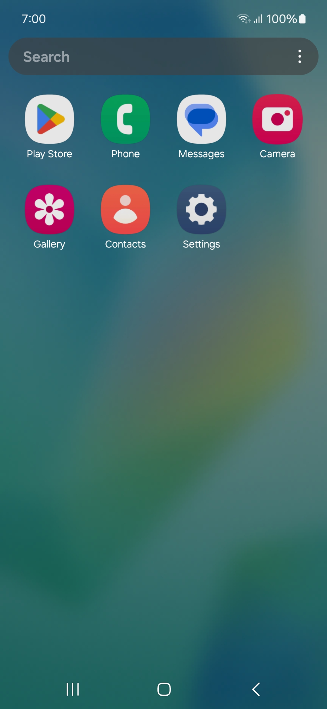

# OneUI Debloat Script

## How to use Script: 
Download the latest release, extract the ZIP file, and run the script from the "debloat" folder. To run the script, connect your phone to your PC using ADB. For best results, use the script during the initial device setup or after a factory reset to avoid losing personal data.

## Choose the Basic, Light, or Heavy script based on your needs:
Basic: For users who want to sign in to their Samsung account.
Light: Recommended for users without a Samsung account.
Heavy: Removes almost all removable apps for maximum system optimization. Be aware that many features might become unavailable.

## Warning:
Light Debloat: Disables Samsung account sign-in and related services. Do not use if you intend to sign in to your Samsung account. Choose the Basic script instead.
Heavy Debloat: Removes most safely removable apps and hence many features may be inaccessible. You can restore these features by reinstalling the corresponding apps.

## Additional Settings and Optimizations:
Following the debloat script, you can further optimize your device by adjusting these settings:

Disable Adaptive Battery: This feature learns your app usage patterns and restricts background activity for less frequently used apps. Disabling it may improve performance for some apps but could impact battery life.
Disable Location Services - Wi-Fi Scanning: This feature uses Wi-Fi to improve location accuracy. Disabling it can save battery but may affect location-based services.
Disable Background Check: This feature automatically checks for updates for system apps. Disabling it saves battery but may delay updates.

## Unrestricted Battery Usage for System Apps:
Open Settings and navigate to Apps.
Enable Show System Apps.
Locate the following apps: One UI Home, your keyboard app, Android System, System UI, and all Gesture apps.
Tap each app and go to Battery.
Set the battery usage to Unrestricted.

## Restoring Removed Apps:
To restore an app you've removed, use the following command via ADB:
~~~
adb shell cmd package install-existing <package name>
~~~

Example:
~~~
adb shell cmd package install-existing com.sec.android.app.samsungapps
~~~
(Replace <package name> with the actual package name of the desired app.)

## Reverting to Stock Condition:
To restore your phone to its original state with all default apps installed, run the script located in the "revert" folder.

## Note:
If you encounter any difficulties, feel free to open an issue or contact me on Telegram. Please mention your device model and firmware version for quicker assistance.

## Visible System Apps (OneUI Core 4.1 - INS Firmware on Samsung M21)
  

### After Light Debloat Script

### After Heavy Debloat Script

## Credits:
Samsung for adding them and me for removing them :)
