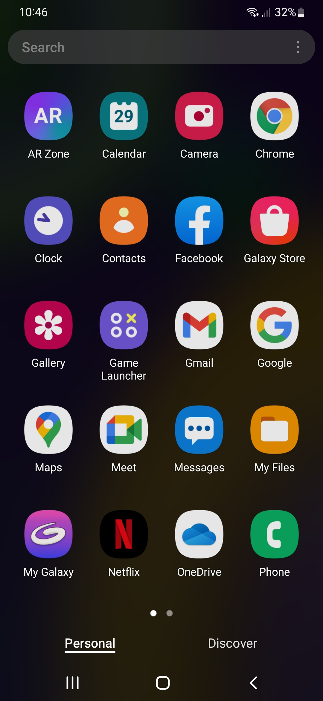
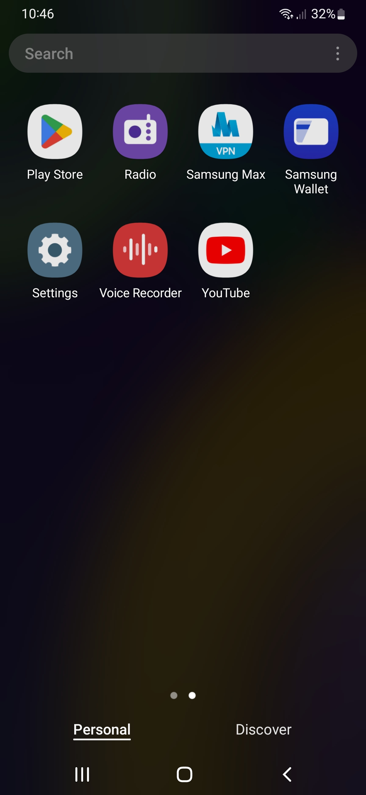
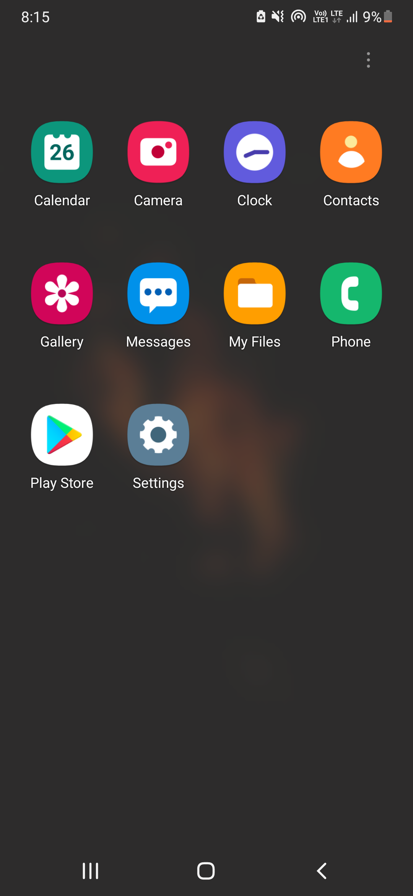

# OneUI Debloat Script by invinciblevenom

## Change these Settings
1. Adaptive Battery: DISABLED
2. Location Services - Wifi Scanning - DISABLED
3. Emergency Location Service: DISABLED
4. Background Check: DISABLED
5. Go to Settings, Apps. Enable "show system apps" then look for each of:
"OneUI Home", "Your Keyboard", "Android System", "System UI", & all the "Gesture" apps.
   - Under app info, Battery, set to UNRESTRICTED
6. Turn off Scene Optimizer
7. Set battery usage to "Unrestricted" for "com.samsung.android.biometrics.app.setting"

## How to: 
Just download the latest release and run the script.

Warning: This is extreme debloat script. It removes almost all apps which can be safely removed. Many features may break after using this.
For normal users, use "Light_debloat.bat"
To restore any app just run the following command:
~~~
adb shell cmd package install-existing <name of package>
~~~

Example- 
~~~
adb shell cmd package install-existing com.sec.android.app.samsungapps
~~~

### Visible System Apps (OneUI Core 4.1 - INS Firmware)
  

### After Script

