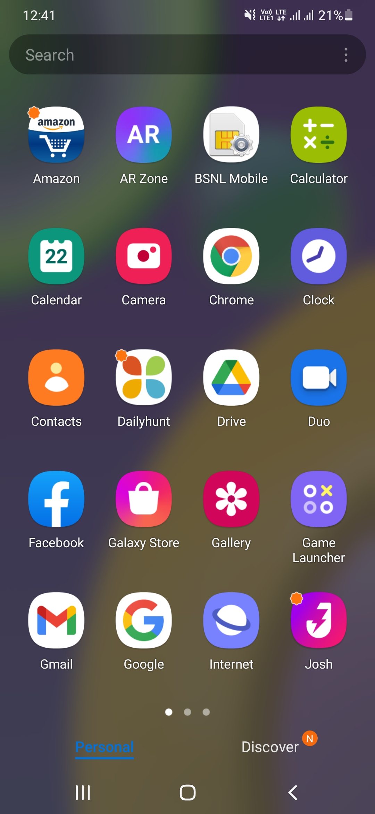
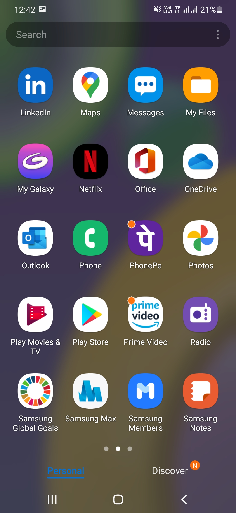
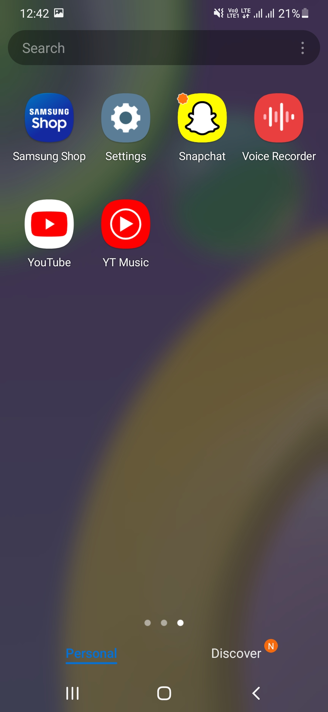

## debloat_samsung_android

## Script by Yillie and invinciblevenom

# How to:
Just download the latest releaseand run the desired script.

Warning: This is extreme debloat script. It removes almost all apps which can be safely removed.
To restore any app just run the following command:
~~~
adb shell cmd package install-existing <name of package>
~~~

For example- 
~~~
adb shell cmd package install-existing com.sec.android.app.samsungapps
~~~

### Visible Installed Apps (OneUI Core 3.1 - INS Firmware)
   
