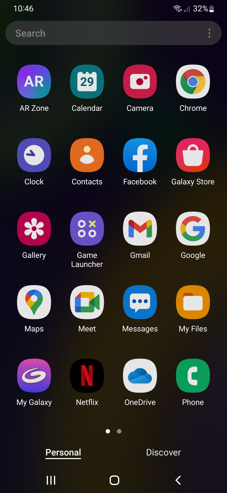
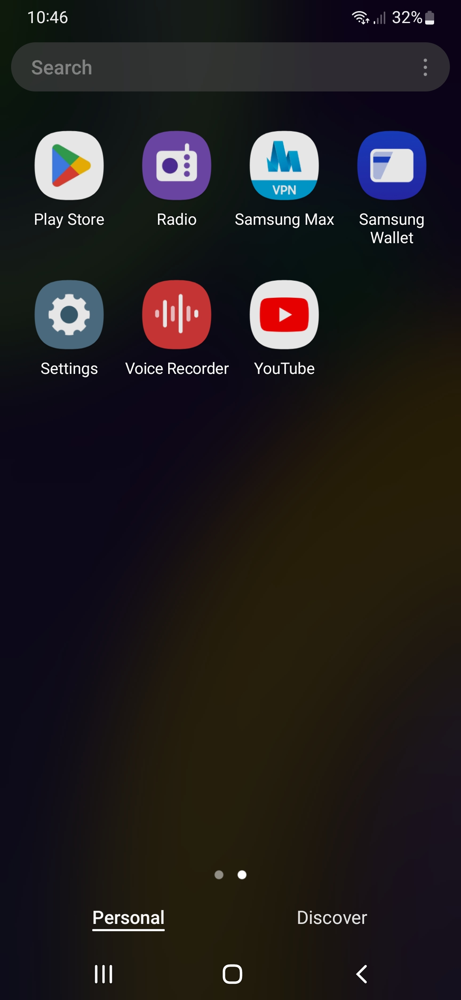

# debloat_samsung_android: Debloat Script by invinciblevenom and Yillie

## How to:
Just download the latest release and run the script.

Warning: This is extreme debloat script. It removes almost all apps which can be safely removed. Many features may break after using this. Information regarding most of the apps have been provided.
To restore any app just run the following command:
~~~
adb shell cmd package install-existing <name of package>
~~~

Example- 
~~~
adb shell cmd package install-existing com.sec.android.app.samsungapps
~~~

### Visible System Apps (OneUI Core 3.1 - INS Firmware)
  
